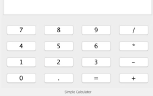
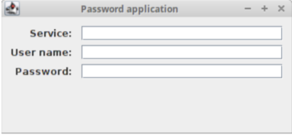

# Java Learning
There are practices dedicated to learning java programming language.

---
## Table of contents
- [x] [practice_1](#practice_1 "Syntax and basic control constructions of the Java language.")
- [x] [practice_2](#practice_2 "Object-oriented programming in Java language.")
- [x] [practice_3](#practice_3 "Math and Random classes. Shell Classes in the Java language.")
- [x] [practice_4](#practice_4 "Enumerations and their use in Java.")
- [x] [practice_4_1](#practice_4_1 "Inheritance in Java. Abstract classes.")
- [x] [practice_5](#practice_5 "Creating programs with a GUI in Java.")
- [x] [practice_6](#practice_6 "Interfaces in Java language.")
- [x] [practice_7](#practice_7 "Implementation of interfaces in Java language.")
- [x] [practice_8](#practice_8 "Recursion programming in Java.")
- [x] [practice_9](#practice_9 "Polymorphism in the implementation of sorting and search algorithms.")
- [x] [practice_10](#practice_10 "The same tasks as in practice 9")
- [x] [practice_11](#practice_11 "Working with date and time in Java.")
- [x] [practice_12](#practice_12 "The same tasks as in practice 5.")
- [x] [practice_13](#practice_13 "String processing in Java.")
- [x] [practice_14](#practice_14 "Regular expressions in Java.")
- [x] [practice_15](#practice_15 "Nested and internal classes. Event handling in Java with a GUI.")
- [x] [practice_16](#practice_16 "Processing mouse and keyboard events in programs with a GUI in java.")
- [x] [practice_17](#practice_17 "seventeenth practice")
- [ ] [practice_18](#practice_18 "eighteenth practice")
- [ ] [practice_19](#practice_19 "nineteenth practice")
- [ ] [practice_20](#practice_20 "twentieth practice")
- [ ] [practice_21](#practice_21 "twenty-first practice")
- [ ] [practice_22](#practice_22 "twenty-second practice")
- [ ] [practice_23](#practice_23 "twenty-third practice")
- [ ] [practice_24](#practice_24 "twenty-fourth practice")
---
## practice_1
>**Syntax and basic control constructions of the Java language.**

- **[task_1](src/practice_1_8/practice_1/Task_3.java)**
> Написать программу, в результате которой массив чисел создается 
> с помощью инициализации (как в Си) вводится и считается в цикле
> сумма элементов целочисленного массива, а также среднее 
> арифметическое его элементов результат выводится на экран. 
> Использовать цикл for.

- **[task_2](src/practice_1_8/practice_1/Task_4.java)**
> Написать программу, в результате которой массив чисел вводится
> пользователем с клавиатуры считается сумма элементов целочисленного
> массива с помощью циклов do while, while, также необходимо найти
> максимальный и минимальный элемент в массиве, результат выводится на
> экран.

- **[task_3](src/practice_1_8/practice_1/Task_5.java)**
> Написать программу, в результате которой выводятся на экран
> аргументы командной строки в цикле for.

- **[task_4](src/practice_1_8/practice_1/Task_6.java)**
> Написать программу, в результате работы которой выводятся на экран
> первые 10 чисел гармонического ряда (форматировать вывод).

- **[task_5](src/practice_1_8/practice_1/Task_7.java)**
> Написать программу, которая с помощью метода класса, вычисляет
> факториал числа (использовать управляющую конструкцию цикла), проверить
> работу метода.

---
## practice_2
>**Object-oriented programming in Java language.**

- **[task_1](src/practice_1_8/practice_2/task_1)**
> Необходимо написать программу, которая состоит из двух классов Author и
> TestAuthor.

- **[task_2](src/practice_1_8/practice_2/task_2)**
> Написать программу, которая состоит из двух классов. Один из них Ball должен
> реализовывать сущность мяч, а другой с названием TestBall тестировать работу
> созданного класса. Класс Ball моделирует движущийся мяч.

- **[task_3](src/practice_1_8/practice_2/task_3)**
> Создать класс точка Point, описывающий точку на плоскости. Создать
> Circle класс, в котором одно поле представляет точку – центр окружности, и
> добавить другие свойства, позволяющие задать точку на плоскости. Создать
> третий класс Tester который использует для хранения объектов массив
> объектов Circle и второе поле количество элементов в массиве.

- **[task_4](src/practice_1_8/practice_2/task_4)**
> Разработайте класс Shop, реализуйте методы добавления и
> удаления компьютеров в магазине, добавьте метод поиска в магазине
> компьютера, нужного пользователю. Протестируйте работу созданных классов.
> Данные для заполнения массива компьютеров вводятся с клавиатуры
> пользователем.

- **[task_5](src/practice_1_8/practice_2/task_5)**
> Разработайте и реализуйте класс Dog (Собака), поля класса
> описывают кличку и возраст собаки. Необходимо выполнить следующие
> действия: определить конструктор собаки, чтобы принять и инициализировать
> данные экземпляра, включить стандартные методы для получения
> и установки для имени и возраста, включить метод для перевода возраста
> собаки в “человеческий” возраст (возраст семь раз собаки), включите метод
> toString(), который возвращает описание экземпляра собаки в виде строки.
> Создание класса тестера под названием ПитомникСобак, реализует массив
> собак и основной метод этого класса позволяет добавить в него несколько
> объектов собаки.

- **[task_6](src/practice_1_8/practice_2/task_6)**
> Создать класс, описывающий модель окружности (Circle). В классе
> должны быть описаны нужные свойства окружности и методы для получения и
> изменения этих свойств. Добавить методы для расчета площади круга и длины
> окружности, а также метод позволяющий сравнивать две окружности. При
> помощи класса CircleTest, содержащего статический метод main(String[] args),
> протестировать работу класса Circle.

- **[task_7](src/practice_1_8/practice_2/task_7)**
> Создать класс, описывающий книгу (Book). В классе должны быть
> описаны нужные свойства книги (автор, название, год написания и т. д.) и
> методы для получения, изменения этих свойств. Протестировать работу класса
> в классе BookTest, содержащим метод статический main(String[] args).
> 
> Создать
> класс книжная полка, в котором поля данных класса это массив объектов типа
> книги (Book), и количество книг на книжной полке. Написать методы класса,
> которые возвращают книги с самым поздним и самым ранним сроком издания.
> Написать метод класса, позволяющий расставить книги на книжной полке в
> порядке возрастания года выпуска. Используйте реализацию отношений
> композиция классов.

- **[task_8](src/practice_1_8/practice_2/Task_8.java)**
> Напишите программу, которая меняет местами элементы
> одномерного массива из String в обратном порядке. Не используйте
> дополнительный массив для хранения результатов.

- **[task_9](src/practice_1_8/practice_2/Task_9.java)**
> Напишите программу Poker.java, которая должна имитировать
> раздачу карт для игры в покер. Программа получает число n, задаваемое с
> консоли пользователем, и раздает карты на n игроков (по 5 карт каждому) из
> перетасованной колоды. Разделяйте пять карт, выданных каждому игроку,
> разделяйте вывод карт каждого игрока пустой строкой.

- **[task_10](src/practice_1_8/practice_2/Task_10.java)**
> Напишите программу HowMany.java, которая определит, сколько
> слов Вы ввели с консоли.

---

## practice_3
>**Math and Random classes. Shell Classes in the Java language.**

- **[task_1](src/practice_1_8/practice_3/Task_1.java)**
> Создать массив вещественных чисел случайным образом, вывести его
> на экран, отсортировать его, и снова вывести на экран (использовать два
> подхода к генерации случайных чисел – метод random() класса Math и класс Random).

- **[task_2](src/practice_1_8/practice_3/task_2)**
> Создать класс точка Point, описывающий точку на плоскости.
Создать Circle класс, в котором одно поле представляет точку – центр
окружности, и добавить другие свойства, позволяющие задать точку на
плоскости. Создать третий класс Tester который использует для хранения
объектов массив объектов Circle и второе поле количество элементов в массиве.
Добавить в класс методы, позволяющие найти самую маленькую и самую
большую окружность. Добавить в класс метод, упорядочивающий хранение
окружностей в массив. Для инициализации полей радиуса и длины окружности
используйте класс Random или метод random() класса Math по желанию.

- **[task_3](src/practice_1_8/practice_3/Task_3.java)**
> Создайте массив из 4 случайных целых чисел из отрезка [10;99], 
> выведите его на экран в строку, далее определите и выведите на экран
> сообщение о том, является ли массив строго возрастающей последовательностью.

- **[task_4](src/practice_1_8/practice_3/Task_4.java)**
> Пользователь должен ввести с клавиатуры размер массива -
> натуральное число больше, так чтобы введенное пользователем число
> сохранялось в переменную n. Если пользователь ввел не подходящее число, то
> программа должна просить пользователя повторить ввод. Создать массив из n
> случайных целых чисел из отрезка [0; n] и вывести его на экран. Создать второй
> массив только из четных элементов первого массива, если они там есть, и
> вывести его на экран.

- **[string_formatting](src/practice_1_8/practice_3/string_formatting)**
> Разработать класс Отчет о сотрудниках:
> 1) Создать класс Employee, у которого есть переменные класса - fullname, salary.
> 2) Создать массив, содержащий несколько объектов этого типа.
> 3) Создать класс Report со статическим методом generateReport,
>    в котором выводится информация о зарплате всех сотрудников.
> 4) Используйте форматирование строк. Пусть salary будет
>    выровнено по правому краю, десятичное значение имеет 2 знака после
>    запятой и можете добавить что-нибудь свое.

---

## practice_4
>**Enumerations and their use in Java.**

- **[task_1](src/practice_1_8/practice_4/Task_1.java)**
> Создать перечисление, содержащее названия времен года.
> 1) Создать переменную, содержащую ваше любимое время года и
>    распечатать всю информацию о нем.
> 2) Создать метод, который принимает на вход переменную созданного
>    вами enum типа. Если значение равно Лето, выводим на консоль “Я
>    люблю лето” и так далее. Используем оператор switch.
> 3) Перечисление должно содержать переменную, содержащую среднюю
>    температуру в каждом времени года.
> 4) Добавить конструктор, принимающий на вход среднюю температуру.
> 5) Создать метод getDescription, возвращающий строку “Холодное время
>    года”. Переопределить метод getDescription - для константы Лето
>    метод должен возвращать “Теплое время года”.
> 6) В цикле распечатать все времена года, среднюю температуру и
>    описание времени года

- **[task_2](src/practice_1_8/practice_4/task_2)**
> Создать перечисление, содержащее размеры одежды (XXS, XS, S, M, L).
> Перечисление содержит метод getDescription, возвращающий строку “Взрослый
> размер”. Переопределить метод getDescription - для константы XXS метод
> должен возвращать строку “Детский размер”. Также перечисление должно
> содержать числовое значение euroSize(32, 34, 36, 38, 40), соответствующее
> каждому размеру. Создать конструктор, принимающий на вход euroSize.
> 1) Создать интерфейсы MenClothing (мужская одежда) с методом
>    dressMan() (одеть мужчину) и WomenClothing (женская одежда) с
>    методом dressWomen() (одеть женщину).
> 2) Создать абстрактный класс Clothes (одежда), содержащий в качестве
>    переменных класса - размер одежды, стоимость, цвет.
> 3) Создать классы наследники класса Clothes – класс TShirt (футболка)
>    (реализует интерфейсы MenClothing и WomenClothing), класс Pants
>    (штаны) (реализует интерфейсы MenClothing и WomenClothing ), класс
>    Skirt (реализует интерфейсы WomenClothing), класс Tie (галстук )
>    (реализует интерфейсы MenClothing).
> 4) Создать массив, содержащий все типы одежды. Создать класс Atelier
>    (Ателье), содержащий методы dressWomen, dressMan, на вход которых
>    будет поступать массив, содержащий все типы одежды (подумайте
>    какой тип будет у массива). Переопределите метод dressWomen() для
>    вывода на консоль всей информации о женской одежде. То же самое
>    сделайте для метода dressMan().

---

## practice_4_1
>**Inheritance in Java. Abstract classes.**

- **[task_1](src/practice_1_8/practice_4_1/task_1)**
> Необходимо реализовать простейший класс Shape (Фигура).
> Добавьте метод класса getType() (тип фигуры, возвращает строку тип String
> название фигуры). С помощью наследования создайте дочерние классы Circle,
> Rectangle и Square.
> 
> Также реализуйте во
> всех классах методы getArea() (возвращает площадь фигуры), getPerimeter()
> (возвращает периметр фигуры). Переопределите в дочерних классах методы класса
> родителя toString(), getArea(), getPerimeter() и getType(). Создать класс-тестер
> для вывода информации об объекте и продемонстрировать вызов методов
> использую родительскую ссылку. Объяснить работу программы.\
> В этом задании, класс Shape определяется как абстрактный
> класс, который содержит:
> * Два поля или переменные класса, объявлены с модификатором
> protected color (тип String) и filled (тип boolean). Такие защищенные
> переменные могут быть доступны в подклассах и классах в одном пакете. Они
> обозначаются со знаком “#” на диаграмме классов в нотации языка UML.
> * Методы геттеры и сеттеры для всех переменных экземпляра
> класса,и метод toString().
> * Два абстрактных метода getArea() и getPerimeter() выделены
> курсивом в диаграмме класса.
>
> В подклассах Circle (круг) и Rectangle (прямоугольник) должны
> переопределяться абстрактные методы getArea() и getPerimeter(), чтобы
> обеспечить их надлежащее выполнение для конкретных экземпляров типа
> подкласс. Также необходимо для каждого подкласса переопределить toString().

- **[task_2](src/practice_1_8/practice_4_1/task_2)**
> Определить класс Reader, хранящий
> такую информацию о пользователе библиотеки: ФИО, номер читательского
> билета, факультет, дата рождения, телефон. Методы takeBook(), returnBook().
> 
> Разработать программу, в которой создается массив объектов данного класса.
> Перегрузить методы takeBook(), returnBook(): - takeBook, который будет
> принимать количество взятых книг. Выводит на консоль сообщение "Петров В.
> В. взял 3 книги". - takeBook, который будет принимать переменное количество
> названий книг. Выводит на консоль сообщение "Петров В. В. взял книги:
> Приключения, Словарь, Энциклопедия". - takeBook, который будет принимать
> переменное количество объектов класса Book (создать новый класс,
> содержащий имя и автора книги). Выводит на консоль сообщение “Петров В. В.
> взял книги: Приключения, Словарь, Энциклопедия”. Аналогичным образом
> перегрузить метод returnBook(). Выводит на консоль сообщение “Петров В. В.
> вернул книги: Приключения, Словарь, Энциклопедия” или “Петров В. В.
> вернул 3 книги”.

- **[exercise](src/practice_1_8/practice_4_1/exercise.java)**
> Исправленный код программы из учебника с объяснениями ошибок.

---

## practice_5
>**Creating programs with a GUI in Java.**

- **[task_1](src/practice_1_8/practice_5/task_1)**
> Напишите интерактивную программу с использованием GUI, которая 
> имитирует таблицу результатов матчей между командами Милан и Мадрид. 
> Создайте пользовательское JFrame приложение, у которого 
> есть следующие компоненты GUI:
> * одна кнопка JButton подписана “AC Milan” 
> * другая JButton подписана “Real Madrid” 
> * надпись JLabel содержит текст “Result: 0 X 0” 
> * надпись JLabel содержит текст “Last Scorer: N/A” 
> * надпись Label содержит текст “Winner: DRAW” \
>
> Всякий раз, когда пользователь нажимает на кнопку AC Milan, результат 
> будет увеличиваться для Милана, сначала 1 X 0, затем 2 X 0 и так далее. Last 
> Scorer означает последнюю забившую команду. В этом случае: AC Milan. Если 
> пользователь нажимает кнопку для команды Мадрид, то счет приписывается 
> ей. Победителем становится команда, которая имеет больше кликов кнопку на 
> соответствующую, чем другая.

- **[task_2](src/practice_1_8/practice_5/task_2)**
> Создать окно, нарисовать в нем 20 случайных фигур, случайного 
> цвета. Классы фигур должны наследоваться от абстрактного класса Shape, в 
> котором описаны свойства фигуры: цвет, позиция.

- **[task_3](src/practice_1_8/practice_5/task_3)**
> Создать окно, отобразить в нем картинку, путь к которой указан в
> аргументах командной строки.

- **[task_4](src/practice_1_8/practice_5/task_4)**
> Создать окно, реализовать анимацию, с помощью картинки,
> состоящей из нескольких кадров.

---

## practice_6
>**Interfaces in Java language.**

- **[task_1](src/practice_1_8/practice_6/task_1)**
> Напишите два класса MovablePoint и MovableCircle, которые 
> реализуют интерфейс Movable.
> Напишите новый класс MovableRectangle (движущийся 
> прямоугольник). Его можно представить как две движущиеся точки 
> MovablePoints (представляющих верхняя левая и нижняя правая точки) и 
> реализующие интерфейс Movable. Убедитесь, что две точки имеют 
> одну и ту же скорость (вам понадобится метод проверяющий это условие).

- **[task_2](src/practice_1_8/practice_6/task_2)**
> Напишите программу для перевода температуры по Цельсию в 
> температуру по Кельвину и Фаренгейту. Для этого добавьте интерфейс 
> Convertable у которого есть метод convert для конвертации из одной системы 
> измерения в другую.

---

## practice_7
>**Implementation of interfaces in Java language.**

- **[task_1](src/practice_1_8/practice_7/task_1)**
> Разработайте интерфейс MathCalculable, который содержит 
> объявления математических функций: возведения в степень и модуль 
> комплексного числа, также содержит число PI. Напишите класс MathFunc, 
> который реализует, реализует этот интерфейс. Например, вычисления 
> длины окружности.\
> 
> Замечание:
```
MathCalculable mc1 = new MathFunc(); // правильно
MathCalculable mс2 = new MathCalculable (); //ошибка - запрещено объявлять экземпляр интерфейса
```

- **[task_2](src/practice_1_8/practice_7/task_2)**
> Разработайте интерфейс для работы со строками, который содержит 
> 1. функция подсчета символов в строке
> 2. функция возвращает строку, состоящую 
> из символов исходной строки s, которые размещены на нечетных позициях: 
> 1, 3, 5, ...
> 3. функция инвертирования строки

---

## practice_8
>**Recursion programming in Java.**

- **[task_1](src/practice_1_8/practice_8/Task_15.java)**
> Дано натуральное число N. Выведите все его цифры по одной, в обратном 
> порядке, разделяя их пробелами или новыми строками. 
> При решении этой задачи нельзя использовать строки, списки, массивы (ну 
> и циклы, разумеется). Разрешена только рекурсия и целочисленная арифметика.

- **[task_2](src/practice_1_8/practice_8/Task_16.java)**
> Дана последовательность натуральных чисел (одно число в строке), 
> завершающаяся числом ноль. Определите, какое количество элементов этой 
> последовательности, равны ее наибольшему элементу.
> 
> В этой задаче нельзя использовать глобальные переменные. Функция 
> получает данные, считывая их с клавиатуры, а не получая их в виде параметра.\
> 
> В программе на языке Python функция возвращает результат в виде кортежа из 
> нескольких чисел, и функция вообще не получает никаких параметров. В 
> программе на языке C++ результат записывается в переменные, которые 
> передаются в функцию по ссылке. Других параметров, кроме как используемых 
> для возврата значения, функция не получает. Гарантируется, что 
> последовательность содержит хотя бы одно число(кроме нуля).


- **[task_3](src/practice_1_8/practice_8/Task_17.java)**
> Дана последовательность натуральных чисел (одно число в строке), 
> завершающаяся числом 0. Определите наибольшее значение числа в этой 
> последовательности.
> 
> В этой задаче нельзя использовать глобальные переменные и передавать 
> какие-либо параметры в рекурсивную функцию. Функция получает данные, 
> считывая их с клавиатуры. Функция возвращает единственное значение:
> максимум считанной последовательности. Гарантируется, что 
> последовательность содержит хотя бы одно число (кроме нуля).

---

## practice_9
>**Polymorphism in the implementation of sorting and search algorithms.**

- **[task_1](src/practice_9_16/practice_9/task_1)**
> Написать тестовый класс, который создает массив класса Student и
> сортирует массив iDNumber и сортирует его вставками.

- **[task_2](src/practice_9_16/practice_9/task_2)**
> Напишите класс SortingStudentsByGPA который реализует 
> интерфейс Comparator таким образом, чтобы сортировать список студентов по 
> их итоговым баллам в порядке убывания с использованием алгоритма быстрой 
> сортировки.

- **[task_3](src/practice_9_16/practice_9/task_3)**
> Напишите программу, которая объединяет два списка данных о
> студентах в один отсортированный списках с использованием алгоритма
> сортировки слиянием.

---

## practice_10
>**The same tasks as in practice 9.**

---

## practice_11
>**Working with date and time in Java.**

- **[task_1](src/practice_9_16/practice_11/Task_1.java)**
> Написать программу, выводящую фамилию разработчика, дату и время 
> получения задания, а также дату и время сдачи задания. Для получения 
> последней даты и времени использовать класс Date из пакета java.util.*
> (Объявление Dated=newDate() или метод System.currentTimeMillis()).

- **[task_2](src/practice_9_16/practice_11/Task_2.java)**
> Приложение, сравнивающее текущую дату и дату, введенную
> пользователем с текущим системным временем.

- **[task_3](src/practice_9_16/practice_11/task_3)**
> Доработайте класс Student: предусмотрите поле для хранения даты 
> рождения, перепишите метод toString() таким образом, чтобы он разработайте 
> метод, возвращал строковое представление даты рождения по вводимому в 
> метод формату даты (например, короткий, средний и полный формат даты).

- **[task_4](src/practice_9_16/practice_11/Task_4.java)**
> Напишите пользовательский код, который формирует объекты Date и 
> Calendar по следующим данным, вводимым пользователем:
> * <Год><Месяц><Число>
> * <Часы1><минуты>

---

## practice_12
>**The same tasks as in practice 5.**

---

## practice_13
>**String processing in Java.**

- **[task_1](src/practice_9_16/practice_13/task_1)**
> Разработать класс Person, в котором имеется функция, 
> возвращающая Фамилию И.О. Функция должна учитывать возможность 
> отсутствия значений в полях Имя и Отчество. Программу оптимизировать с 
> точки зрения быстродействия (StringBuilder).

- **[task_2](src/practice_9_16/practice_13/task_2)**
> Разработайте класс, который получает строковое 
> представление телефонного номера в одном из двух возможных строковых 
> форматов:
> * +<Код страны><Номер 10 цифр>, например “+79175655655” или 
> “+104289652211” 
> * 8<Номер 10 цифр> для России, например “89175655655”\
> 
> и преобразует полученную строку в формат:\
+<Код страны><Три цифры>–<Три цифры>–<Четыре цифры>

- **[task_3](src/practice_9_16/practice_13/task_3)**
> В методе main считайте с консоли имя файла, который 
> содержит слова, разделенные пробелом. В методе getLine() используя 
> StringBuilder расставьте все слова в таком порядке, чтобы последняя буква 
> данного слова совпадала с первой буквой следующего не учитывая регистр. 
> Каждое слово должно участвовать 1 раз.

---

## practice_14
>**Regular expressions in Java.**

- **[task_1](src/practice_9_16/practice_14/Task_1.java)**
> Дан текст со списками цен. Извлечь из него цены в USD, RUВ, EU.
> * пример правильных выражений: 25.98 USD. 
> * пример неправильных выражений: 44 ERR, 0.004 EU.

- **[task_2](src/practice_9_16/practice_14/Task_2.java)**
> Дан текст, необходимо проверить есть ли в тексте цифры, за 
> которыми не стоит знак «+». 
> * пример правильных выражений:(1 + 8) – 9 / 4.
> * пример неправильных выражений: 6 / 5 – 2 * 9.

- **[task_3](src/practice_9_16/practice_14/Task_3.java)**
> Написать регулярное выражение, определяющее является ли данная 
> строчка датой в формате dd/mm/yyyy. Начиная с 1900 года до 9999 года.
> * пример правильных выражений: 29/02/2000, 30/04/2003,
01/01/2003.
> * пример неправильных выражений: 29/02/2001, 30-04-2003, 1/1/1899.

- **[task_4](src/practice_9_16/practice_14/Task_4.java)**
> Написать регулярное выражение, определяющее является ли данная 
> строчка допустимым (корректным) е-mail адресом согласно RFC под номером 2822.
> * пример правильных выражений: user@example.com, root@localhost 
> * пример неправильных выражений: myhost@@@com.ru, @my.ru, Julia String.

- **[task_5](src/practice_9_16/practice_14/Task_5.java)**
> Проверить, надежно ли составлен пароль. Пароль считается
> надежным, если он состоит из 8 или более символов. Где символом может быть 
> цифра, английская буква, и знак подчеркивания. Пароль должен содержать хотя 
> бы одну заглавную букву, одну маленькую букву и одну цифру.
> * пример правильных выражений: F032_Password, TrySpy11. 
> * пример неправильных выражений: smart_pass, A007.

---

## practice_15
>**Nested and internal classes. Event handling in Java with a GUI.**

- **[task_1](src/practice_9_16/practice_15/task_1)**
> Напишите программу калькулятор. Реализуйте сложение вычитание, деление 
> и умножение для двух чисел, которые вводятся с клавиатуры.

- **[task_2](src/practice_9_16/practice_15/task_2)**
> Разработайте программу выбора меню с JMenuItem: Australia,
> China, England, Russia. Вам понадобится JComboBox.
> При выборе пункта меню должна выводится информация о стране.

- **[task_3](src/practice_9_16/practice_15/task_3)**
> Разработайте программу с меню, двумя кнопками и текстовым 
> полем ввода. В этой программе у вас должны быть разные настройки в меню. 
> Должно быть меню «Файл», которое включает в себя подменю «Сохранить», 
> «Выйти» и «Правка», меню редактирования, включающее в себя подменю 
> «Копировать, вырезать, вставить» и меню «Справка».\
> 
> Замечание. Для выполнения задания вам понадобятся следующие классы:
GridLayout, JButton, JFrame, JMenu, JMenuBar, JMenuItem, JPanel, JTextArea.


- **[task_4](src/practice_9_16/practice_15/task_4)**
> Разработайте программу-калькулятор вида как представлено на 
> рисунке ниже.\
> 
> 

---

## practice_16
>**Processing mouse and keyboard events in programs with a GUI in java.**

- **[task_1](src/practice_9_16/practice_16/task_1)**
> Реализуйте игру-угадайку, которая имеет одно текстовое поле и 
> одну кнопку. Она предлагает пользователю угадать число между 0-20 и дает ему 
> три попытки. Если ему не удастся угадать, то будет выведено сообщение, что 
> пользователь допустил ошибку в угадывании и что число меньше/больше. Если 
> пользователь попытался три раза угадать, то программу завершается с 
> соответствующим сообщением. Если пользователь угадал, то программа 
> должна тоже завершаться с соответствующим сообщением.\
> 
> Реализация приложения Java, которое имеет макет границы и надписи для каждой области
в макете. Теперь определим события мыши, чтобы:
> * Когда мышь входит в область CENTER программа показывает 
> диалоговое окно с сообщением “Добро пожаловать в ЦАО” 
> * Когда мышь входит в область WEST программа показывает 
> диалоговое окно с сообщением “Добро пожаловать в ЗАО” 
> * Когда мышь входит в область SOUTH программа показывает 
> диалоговое окно с сообщением “Добро пожаловать ЮАО” 
> * Когда мышь входит в область NORTH программа показывает 
> диалоговое окно с сообщением “Добро пожаловать в САО” 
> * Когда мышь входит EAST программа показывает диалоговое окно с 
> сообщением “Добро пожаловать в ВАО”

- **[task_2](src/practice_9_16/practice_16/task_2)**
> Реализуйте программу на Джава с использованием JTextArea и 
> двумя меню выбора:
> * Цвет: который имеет возможность выбора из три возможных:
> синий, красный и черный.
> * Шрифт: три вида: “Times New Roman”, “MS Sans Serif”, “Courier New”. 
> 
> Замечание. Вы должны написать программу, которая с помощью меню 
> может изменять шрифт и цвет текста, написанного в JTextArea.

- **[task_3](src/practice_9_16/practice_16/task_3)**
> Реализуйте программу Проверка пароля на Джава с использованием 
> Layout менеджеров компоновки. Окно программы должно иметь вид
> как на рисунке ниже.
> 
> 

---

## practice_17


---

## practice_18

---

## practice_19

---

## practice_20

---

## practice_21

---

## practice_22

---

## practice_23

---

## practice_24

---


